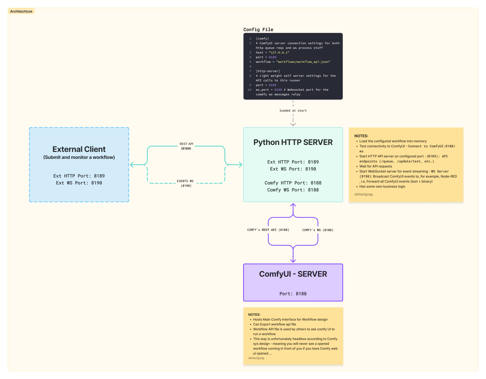

# README

> WIP



A general purpose yet advanced python-based middleware service that provides a comprehensive REST API interface for executing ComfyUI workflows. It features real-time WebSocket event streaming, relaying web socket messages from ComfyUI to others. For example, sending realtime preview image data byte streams from KSampler nodes via websockets.
It is also capable of dynamically updating input node values and is designed to be general purpose with flexible configuration-driven node management.

## Features

1. Flexible Node Management: Configure node IDs in config.toml instead of hardcoding - NEW!
2. REST API Interface: Comprehensive HTTP endpoints for workflow execution
3. Real-time WebSocket Streaming: Live progress updates and preview images
4. Dynamic Workflow Updates: Modify text prompts and images without reloading
5. External Integration: Forward HTTP requests and ComfyUI progress data via separate WebSocket relay
6. Multiple Workflow Support: Easy switching between different workflows - ENHANCED!
7. Production Ready: Proper error handling, logging, and status management

## Overview

This script allows you to:

1. Load and execute a ComfyUI workflow from JSON files, exported from ComfyUI (after __dev__ mode is enabled you can select `export _Export(API)`) and store the json file in the root directory as `workflow_api.json`.
2. Monitor execution progress in real-time via WebSocket and forward them
3. Interrupt workflow execution when needed

### Core Capabilities

1. __REST API Interface__: Execute ComfyUI workflows via HTTP endpoint
2. __Real-time WebSocket Streaming__: Stream execution events and preview images to connected clients
3. __Dynamic Workflow Updates__: Modify text prompts and images in workflows without reloading
4. __External Integration & Interaction__: Forward HTTP requests and Comfy progress and image data via a separate web-socket relay to integrate with Node-RED and or other AI services like OLLAMA
5. __Interrupt & Queue Management__: Cancel running workflows and manage execution queue
6. __Health Monitoring__: Built-in health checks and connection status monitoring (_Although we do not really use it, but it is there_)

## Requirements

- Python 3.12+ and uv
- ComfyUI server running and accessible
- Node-RED (optional)

## Project Structure

```txt
├── main.py                     # Main application server
├── config_example.toml         # Configuration template
├── pyproject.toml              # Project dependencies & metadata
├── test_ws_client.py           # WebSocket testing client
└── workflows/
    └── mouse_knight_api.json   # workflow API export from Comfy (Mouse Knight scene generation workflow)
```

### Installation & Setup

1. Clone the repo
2. Install the dependencies simply typing the cmd below in the root of the project. It creates a project specific virtual environment and installs project specific python version and dependencies

```bash
 uv sync
 # Activate the virtual environment by using one of the following source commands
 source .venv/bin/activate.fish # if your shell is fish (Linux / macOS)
 source .venv/bin/activate # if your shell is bash (Linux / macOS)
 .venv\Scripts\activate # # if your shell is PowerShell (Win)
```

3. Prepare your workflow

    - Export your ComfyUI workflow in API format (Enable Dev mode → Save → Export (API Format))
    - Place the JSON file in the `workflows/` directory
    - Update the `workflow` path in `config.toml` (Next Step actually)

4. Configure

```bash
# Make a copy of the template first
cp config_example.toml config.toml
```

```toml
[comfy]
# ComfyUI server connection settings for both http queue requests and ws process stuff
host = "127.0.0.1" # ComfyUI server IP address. Preferably same computer where ComfyUI is running
port = 8188        # ComfyUI server port (default: 8188)
workflow = "workflows/02_mouse_knight_tu-aa-datta_api.json" # change it if you have a different Comfy workflow file

[http-server]
# Light weight self server settings for the API calls to this runner
port = 8189    # Port for the middleware HTTP API

[server]
ws_port = 8190 # Websocket port for the ComfyUI ws messages relay

# FLEXIBLE NODE MAPPINGS - Configure these based on your workflow
[node_mappings]
ollama_node = "220"        # Node ID for Ollama/Text node - CHECK YOUR WORKFLOW  

# Optional: Additional node mappings for different workflows
[node_mappings.text_to_image]
# prompt = "6"
# negative_prompt = "7"
# sampler = "3"
# save_image = "9"

[node_mappings.img2img]
# load_image = "10"
```


5. Running

```bash
uv run main.py

# Make sure comfyUi is running ...
```

The server will:

- Load the configured workflow into memory
- Test connectivity to ComfyUI - Connect to ComfyUI:8188/ws
- Start HTTP API server on configured port - (8189): API endpoints (/queue, /update/text, etc.)
- Start WebSocket server for event streaming - WS Server (8190): Broadcast ComfyUI events to, for example, Node-RED , i.e, Forward aLL ComfyUI events (text + binary)
- Wait for API requests

### Data Flow Summary

1. __Client Request__: HTTP requests sent to middleware API
2. __Workflow Update__: Middleware modifies in-memory workflow JSON
3. __Execution__: Workflow submitted to ComfyUI via `/prompt` endpoint
4. __Monitoring__: Real-time events streamed via WebSocket from ComfyUI
5. __Broadcasting__: Events relayed to all connected WebSocket clients
6. __Completion__: Generated images accessible via ComfyUI's file system
  
### Port Configuration

- __8188__: ComfyUI server (HTTP + WebSocket)
- __8189__: Middleware HTTP API (configurable)
- __8190__: Middleware WebSocket relay (configurable)


## HTTP API Endpoints

### Base URL Configuration

```txt
Base URL: http://<comfy.host>:<server.port>
Default: http://127.0.0.1:8189
```

| Endpoint | Content | Auth | Type | Response | Expected Behavior |
|----------|---------|------|------|----------|-------------------|
| `GET /health` | None | None | JSON | `"ComfyUI Workflow Runner is running"` | Health check endpoint. Returns simple text response indicating server status. Used for monitoring and load balancer health checks. |
| `GET /queue` | None | None | JSON | `{"STATUS": "Workflow completed successfully", "image_filename": "scene_00001.png", "image_url": "http://127.0.0.1:8188/view?filename=scene_00001.png&type=output"}` | Executes the currently loaded workflow. Waits for completion and returns generated image information. Blocks until workflow finishes or fails. |
| `POST /update/text` | `{"node_id": 17, "text": "mystical forest scene"}` | None | JSON | `"Updated text in node 17 successfully"` | Updates text content in a specific workflow node. Modifies the in-memory workflow without executing it. Node must exist and accept text input. |
| `POST /update/image` | `{"node_id": 46, "filename": "character.png"}` | None | JSON | `"Updated image in node 46 to character.png successfully"` | Updates image filename in a LoadImage node. The image file must already exist in ComfyUI's input directory. Modifies workflow without execution. |
| `POST /generate/image` | `{"image_description": {"description": "knight mouse", "visualCue": "armor details", "moodCue": "heroic"}}` | None | JSON | `{"STATUS": "success", "positive_prompt": "...", "negative_prompt": "..."}` | Forwards image description to Node-RED for AI-powered prompt generation. Acts as a relay between client and Node-RED Ollama integration. Response depends on Node-RED configuration. |
| `POST /interrupt` | None | None | JSON | `{"STATUS": "Interrupt request received, processing..."}` | Immediately stops any running workflow execution and clears the queue. Sends interrupt signal to ComfyUI and resets internal state to idle. Returns immediately while processing in background. |

/update/text endpoint (finds "text" field)
/update/prompt endpoint (finds "prompt" field)

anything from here:
text_input_keys = [
    "text",
    "value",
    "text_positive",
    "text_negative",
    "prompt",
    "system",
    "style",
    "style_name",
    "key",
    "url",
    "model",
]

note to change the prompt saving node's paths in workflow file ...seems to be working

---

## WebSocket API

### Connection Details

```txt
WebSocket URL: ws://<comfy.host>:<server.ws_port>
Default: ws://127.0.0.1:8190
```

| Event Type | Content Format | Auth | Message Type | Response/Data | Expected Behavior |
|------------|----------------|------|--------------|---------------|-------------------|
| __Connection__ | N/A | None | Control | Connection established | Client connects to WebSocket server. Server adds client to broadcast list. Multiple clients can connect simultaneously. |
| __Text Events__ | `{"type": "progress", "data": {"value": 5, "max": 25}}` | None | JSON | Progress, execution status, node updates | Real-time workflow execution events from ComfyUI. Includes progress updates, node execution status, and completion notifications. |
| __Binary Events__ | `[8-byte header][image data]` | None | Binary | Preview images during generation | Real-time preview images sent as binary data. First 8 bytes contain event type (little-endian), followed by PNG/JPEG image data. |
| __Disconnection__ | N/A | None | Control | Client removed from broadcast list | When client disconnects, server automatically removes them from the broadcast list and cleans up resources. |

### WebSocket Event Types

#### Text Events (JSON Format)

| Event Type | Example Data | Description |
|------------|--------------|-------------|
| `execution_start` | `{"type": "execution_start", "data": {"prompt_id": "abc123"}}` | Workflow execution has begun |
| `executing` | `{"type": "executing", "data": {"node": "10", "prompt_id": "abc123"}}` | Specific node is currently executing |
| `progress` | `{"type": "progress", "data": {"value": 10, "max": 25}}` | Progress update with current step |
| `executed` | `{"type": "executed", "data": {"node": "10", "output": {...}}}` | Node completed execution with output |
| `execution_complete` | `{"type": "execution_complete", "data": {"prompt_id": "abc123"}}` | Workflow finished successfully |
| `execution_error` | `{"type": "execution_error", "data": {"exception_message": "..."}}` | Workflow failed with error |

#### Binary Events (Preview Images)

```txt
Structure: [Event Type: 8 bytes][Image Data: Variable length]
Event Type: Little-endian 64-bit integer
Image Data: PNG/JPEG binary data
```

---

## Usage Examples

### Complete Workflow Example

```bash
# 1. Check server health
curl http://127.0.0.1:8189/health

# 2. Update positive prompt
curl -X POST http://127.0.0.1:8189/update/text \
  -H "Content-Type: application/json" \
  -d '{"node_id": 17, "text": "magical forest with glowing mushrooms, mystical atmosphere"}'

# 3. Update character image
curl -X POST http://127.0.0.1:8189/update/image \
  -H "Content-Type: application/json" \
  -d '{"node_id": 46, "filename": "knight_character.png"}'

# 4. Execute workflow
curl http://127.0.0.1:8189/queue

# 5. Interrupt if needed
curl -X POST http://127.0.0.1:8189/interrupt
```


---

### Extra

There is a test script to act as a dummy ws relay receiver tests

## License

[MIT](LICENSE)

## ComfyUI API

[COMFYUI_API.md](docs/COMFYUI_API.md)

---

```txt
Saurabh Datta
2025
```
